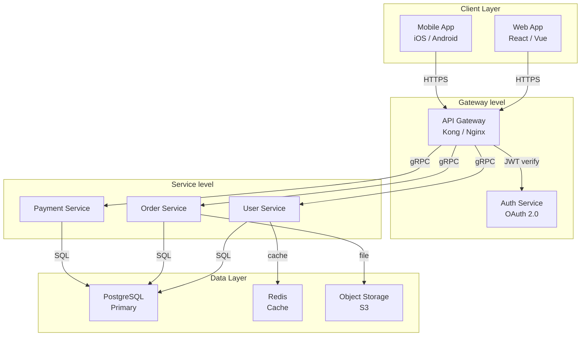
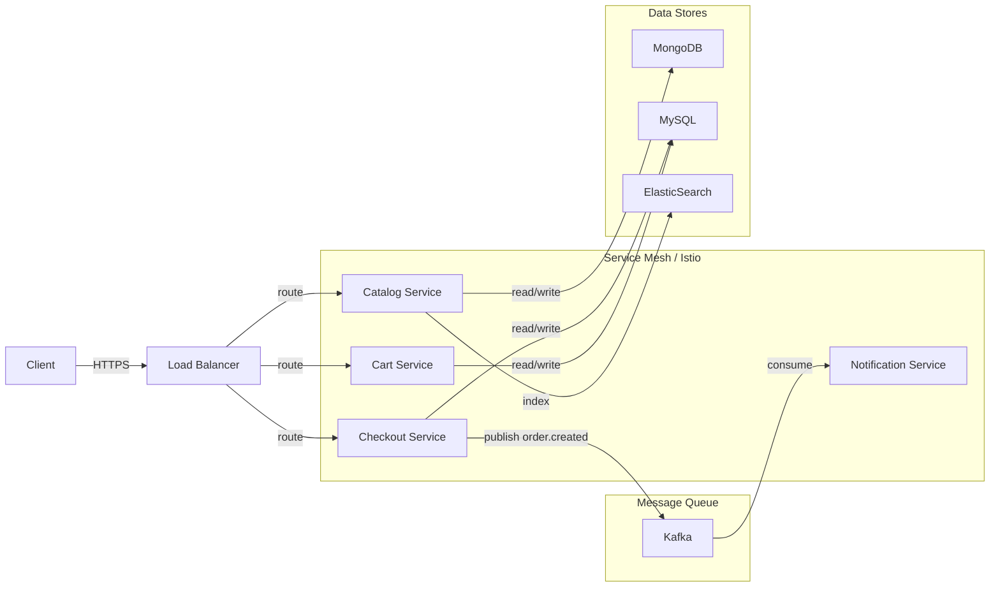
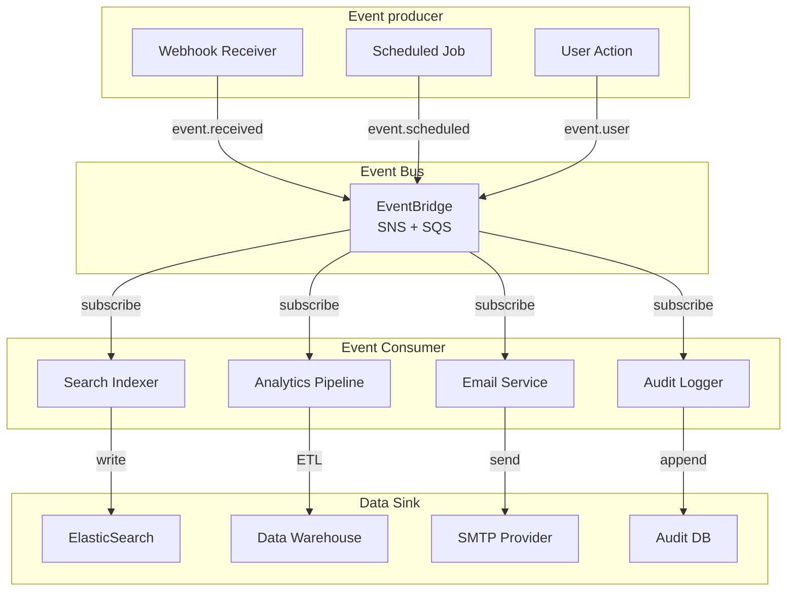
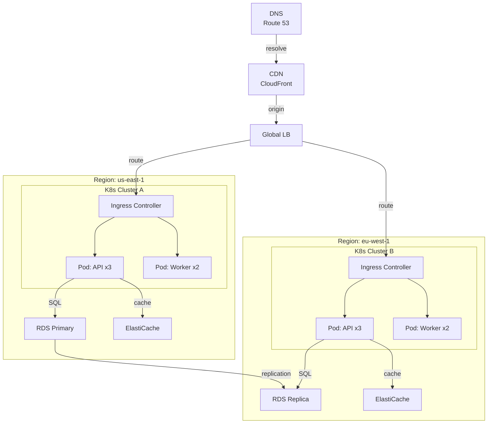

# Architecture Diagram Examples

## 1. Overview

Architecture diagrams show a system's building blocks and their interactions, helping engineers quickly understand the overall structure, responsibility boundaries, and data flow.
This document provides Mermaid examples of common architecture patterns that can be used directly or adapted.

---

## 2. Layered architecture

Each layer has a distinct responsibility, and dependencies flow downward rather than upward.

---

## 3. Microservice architecture

In a microservice architecture, independently deployable services form the system, supported by message queues, service meshes, and service discovery.

---

## 4. Event-driven architecture

In an event-driven architecture, components communicate through events, enabling loose coupling and asynchronous processing.

---

## 5. Deployment topology

A deployment diagram shows the physical and logical layout of infrastructure, including regions, clusters, and load balancers.

