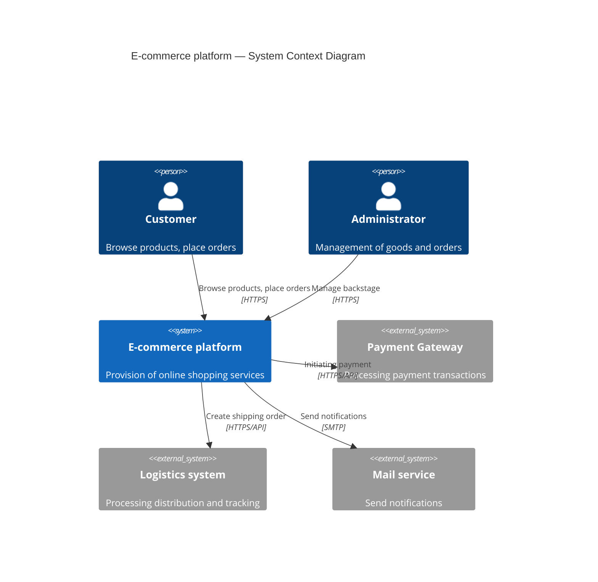
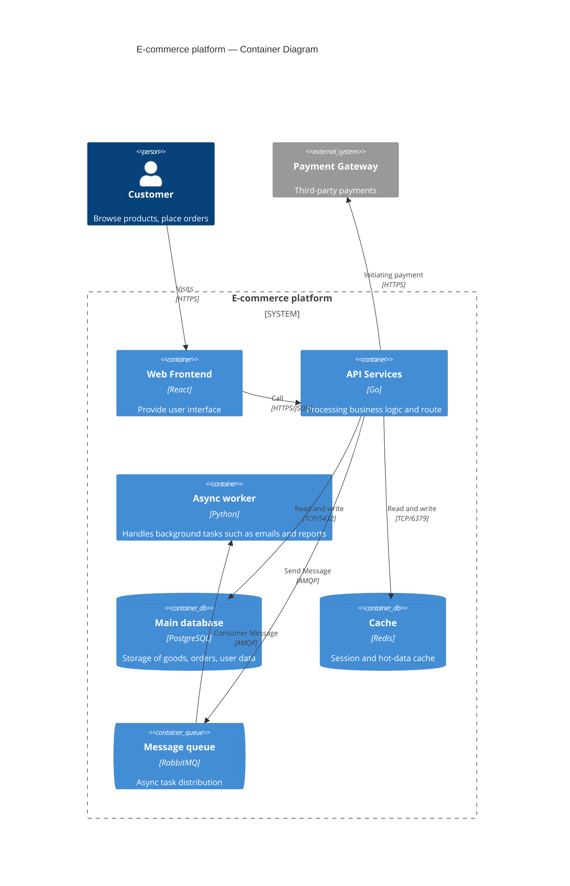
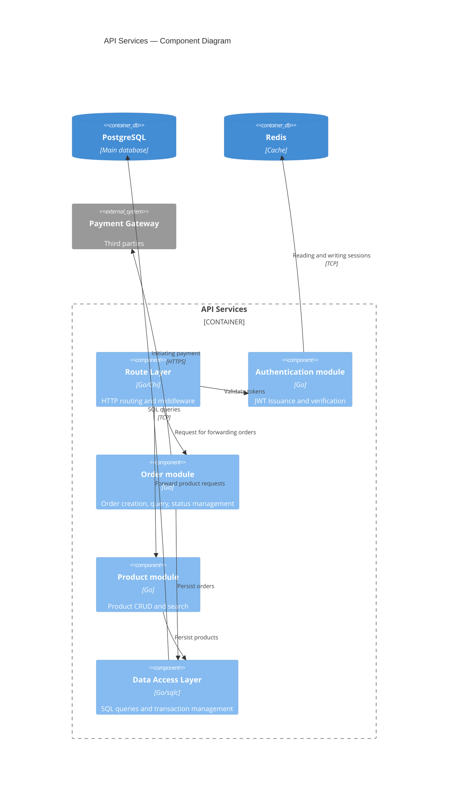

# C4 Model reference

## Overview

C4 is a software architecture visualization model created by Simon Brown. It has four levels:

1. **Context** — The system's relationships with external users and systems; the broadest view
2. **Container** — Runtime units within the system, such as web applications, API services, databases, and message queues
3. **Component** — Logical modules and divisions of responsibility within a single container
4. **Code** — The class-diagram level, usually generated by an IDE rather than drawn manually

Choose a level that matches the audience. Use Context/Container for architecture reviews and Component/Code for developers.

> **Note**: Mermaid's C4 syntax (`C4Context`, `C4Container`, and `C4Component`) is an experimental extension.
> Mainstream renderers such as GitHub, VS Code, and Mermaid Live Editor support it,
> but the `parse()` API in the `mermaid` npm package may not fully support this syntax.
> The following examples use standard C4 Mermaid syntax and should render correctly in supported renderers.

---

## Context diagram

A system context diagram shows the complete set of interactions between the system, its users, and external systems.

---

## Container diagram

A container diagram shows the runtime units within the system and the technologies they use.

---

## Component diagram

A component diagram shows the logical modules and dependencies within a single container.

