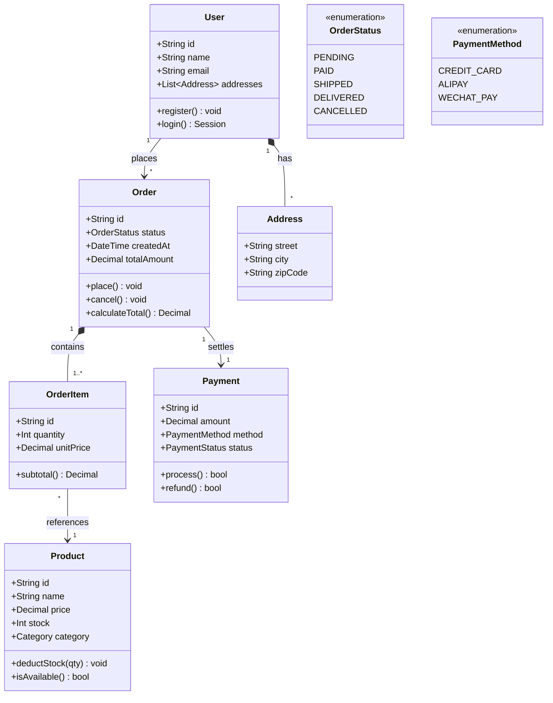
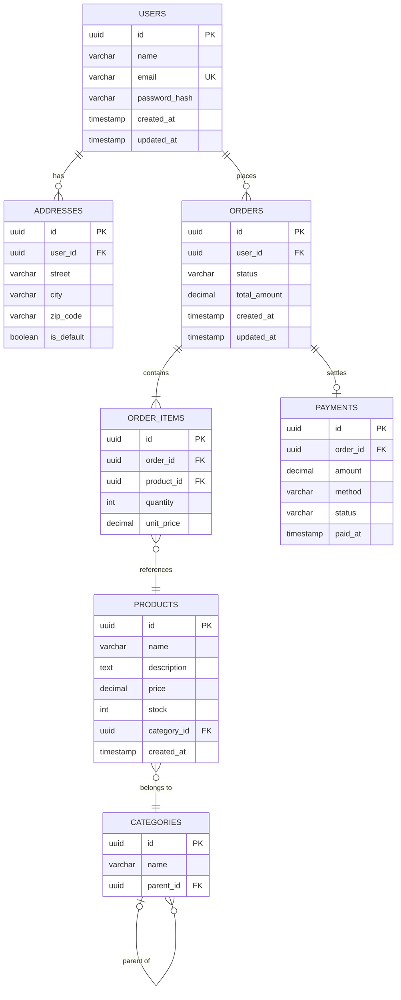

# Class and ER Diagram Reference

## Class diagram overview

Class diagrams (`classDiagram`) represent **object structures, inheritance relationships, and interface contracts**. Use a class diagram for:

- Domain model design that shows relationships between entities
- Inheritance hierarchies between interfaces and implementations
- Structural descriptions of design patterns
- Fields and methods in API data models

Relationship symbols:

| Symbol | Meaning |
|------|------|
| `<\|--` | Inheritance |
| `*--` | Composition |
| `o--` | Aggregation |
| `-->` | Association |
| `..>` | Dependency |
| `..\|>` | Realization |

---

## Domain model

Core models in an e-commerce domain—User, Order, Product, and Payment—and their relationships.

Key points:
- `<<enumeration>>` identifies an enumeration type.
- Enclose generic type parameters in `~`, as in `List~Address~`.
- Label both ends of a relationship with cardinalities such as `"1"`, `"*"`, and `"1..*"`.
- Include return types on methods and data types on fields.

---

## ER diagram overview

ER diagrams (`erDiagram`) represent **database table structures and relationships between tables**. Use an ER diagram for:

- Database schema design and review
- Visualization of foreign-key relationships
- Structural comparisons of data migration plans

Cardinality symbols:

| Symbol | Meaning |
|------|------|
| `\|\|` | Exactly one |
| `o\|` | Zero or one |
| `}o` | Zero or more |
| `}\|` | One or more |

---

## Database Schema

An e-commerce database schema showing table structures and foreign-key relationships.

Key points:
- Label fields with their types and constraints (`PK`, `FK`, `UK`).
- Express cardinality with symbol pairs; for example, `||--o{` means one to zero-or-more.
- Express self-referential relationships, such as parent-child categories, with the same table at both ends.
- Enclose relationship labels in quotation marks and keep them concise.
