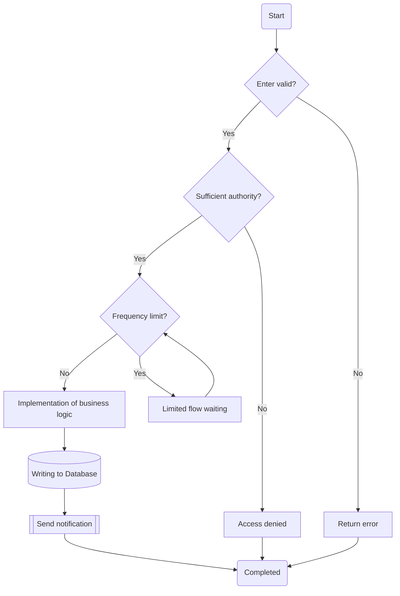
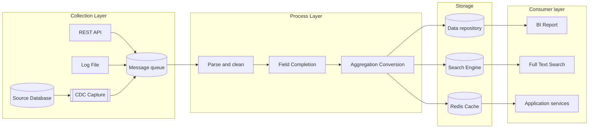
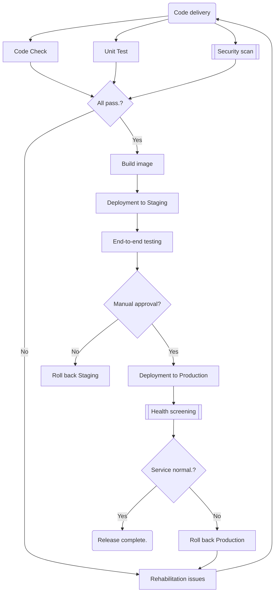

# Flowchart reference

## Overview

Flowcharts represent the logical flow of **processes, decisions, and pipelines**. Use a flowchart for:

- Business approval processes with multiple levels of conditional branches
- Data-processing pipelines, including ETL and stream processing
- CI/CD deployment processes with stages and gates
- Troubleshooting decision trees

Choose a direction:
- `flowchart TB` (top to bottom) for hierarchical processes
- `flowchart LR` (left to right) for linear pipelines

Node shapes:

| Shape | Syntax: | Purpose |
|------|------|------|
| Rectangle | `[text]` | Processing step |
| Diamond | `{text}` | Condition |
| Round corner | `(text)` | Start or end node |
| Cylinder | `[(text)]` | Database/Storage |
| Subprocess | `[[text]]` | Subprocess call |

---

## Decision streams

Diamond nodes express conditional branches in approval, validation, routing, and similar flows.

Key points:
- Use diamonds (`{}`) for conditions and label outgoing arrows with values such as `|Yes|` / `|No|`.
- Create loops by pointing an arrow back to an upstream node, as in `Throttle --> RateLimit`.
- Converge terminal paths on a common end node to keep the diagram clean.

---

## Data-processing pipelines

For ETL or stream-processing pipelines, use `flowchart LR` to show data moving from left to right.

Key points:
- Use `subgraph` to group stages by logical layer.
- Use cylinders (`[()]`) for storage and subprocess shapes (`[[]]`) for reusable processing modules.
- Show multiple sources flowing into the same node with parallel `-->` arrows.

---

## CI/CD Process

A typical continuous integration and deployment pipeline with stage gates and parallel tasks.

Key points:
- Parallel tasks (Lint / Test / Security) all point to the gate node.
- Represent gates as diamonds and route failures back for fixes.
- Represent manual approval as a decision node to make the manual step explicit.
- Use a subprocess shape for the health check to emphasize that it is an independent, reusable step.
