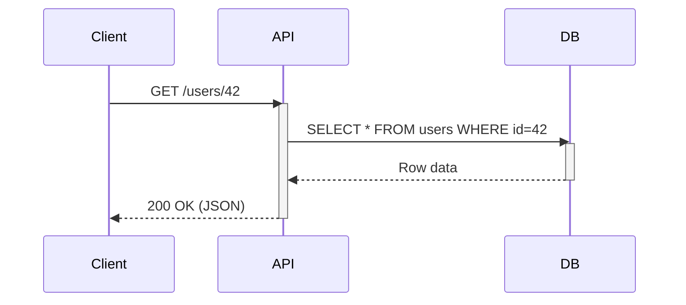
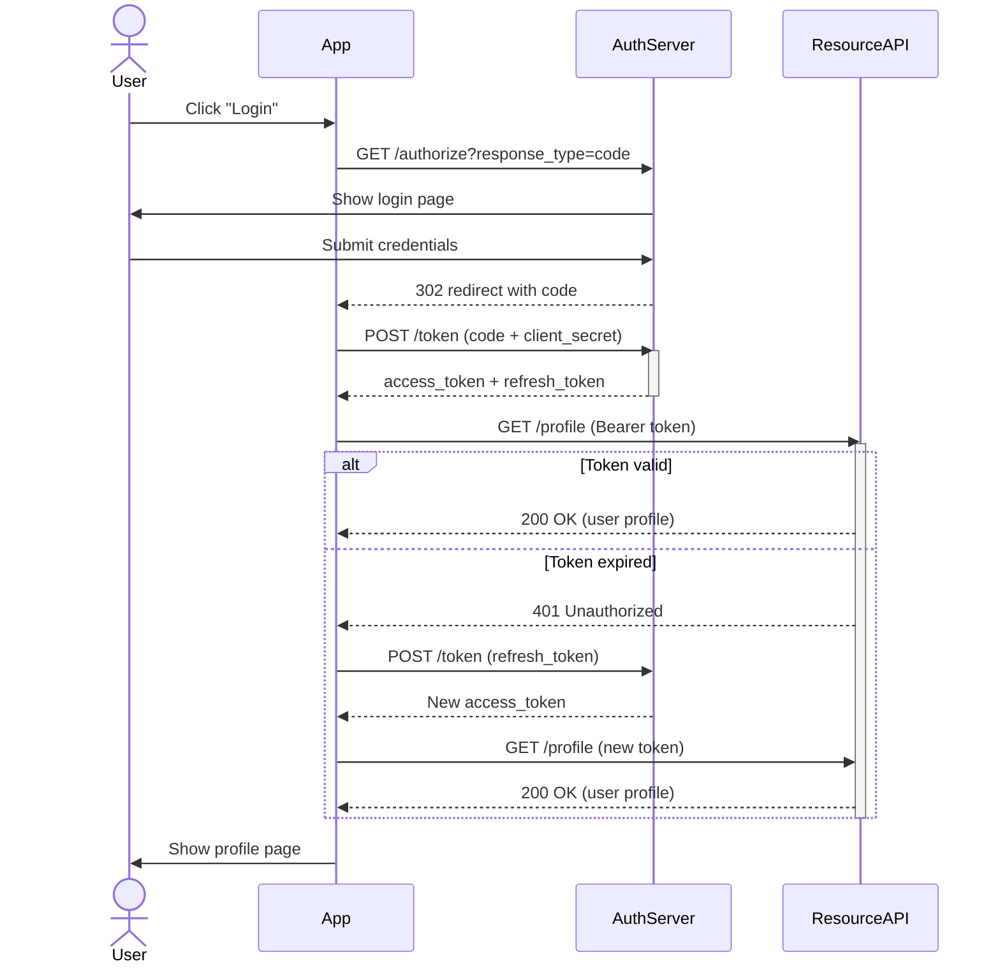
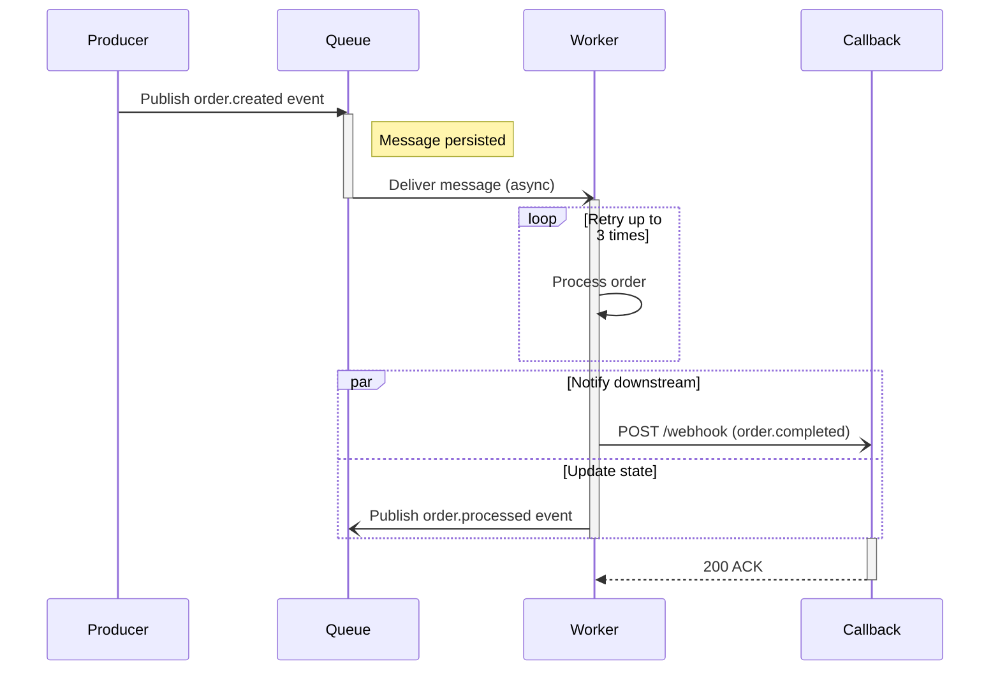
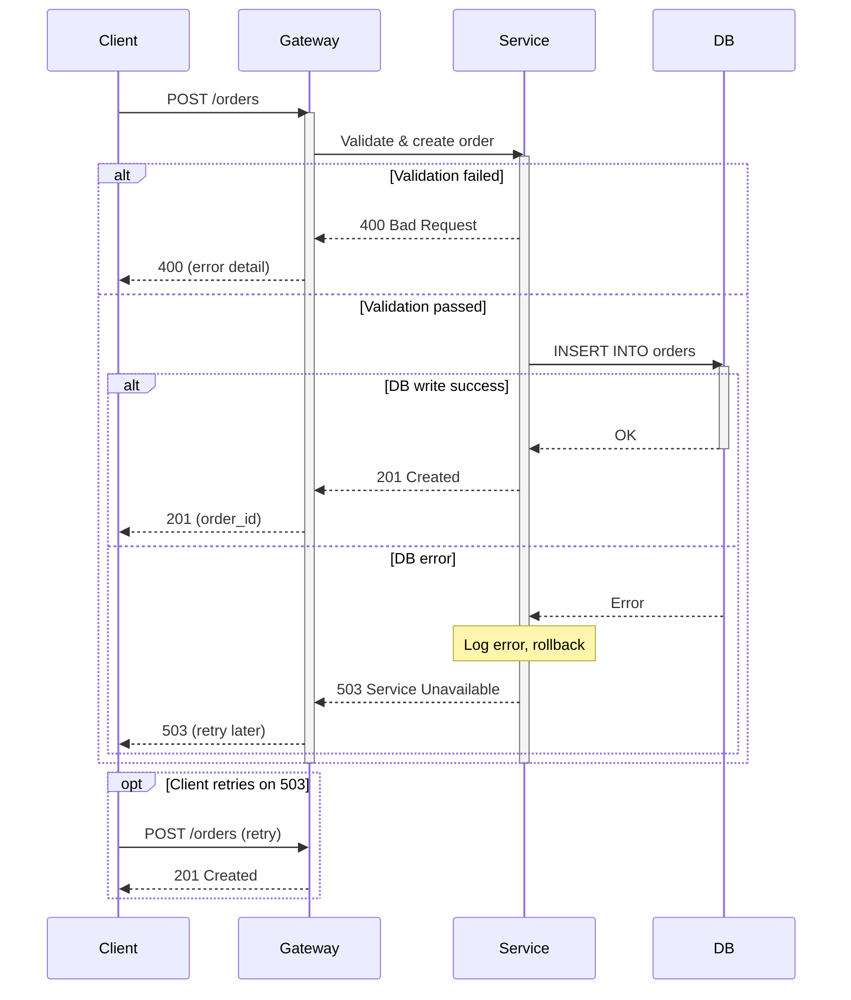

# Sequence Diagram Reference

## Overview

A sequence diagram shows the order of messages exchanged between participants. Use one for:

- Synchronous or asynchronous calls between services
- Authentication and authorization flows
- Error and retry paths
- Event-driven message delivery

## Basic call

The simplest synchronous request-response pattern.

## Authentication process

An OAuth2 authorization code flow involving multiple participants.

## Asynchronous messages

An asynchronous flow decoupled through a message queue, including callback notifications.

## Error handling

Use `alt` and `opt` blocks to represent normal and error branches.

