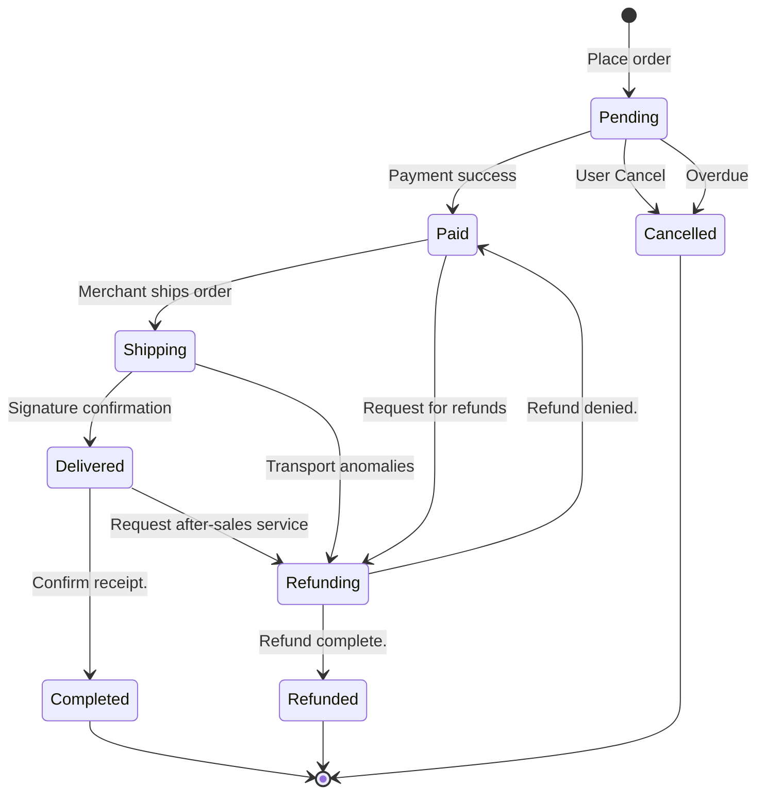
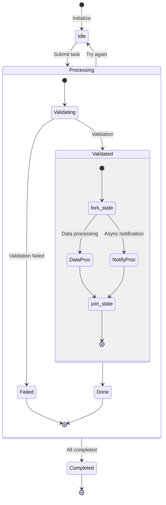

# State Diagram Reference

## Overview

State diagrams (`stateDiagram-v2`) represent **state transitions during an object's lifecycle**. Use a state diagram for:

- State machines for business entities such as orders, work orders, and approvals
- Finite-state machines for protocol handshakes and connection management
- Nested structures involving composite states and concurrent regions

Syntax notes:
- `[*]` represents the initial or final pseudostate.
- `-->` represents a state transition; add the triggering event after `:`.
- `state "..." as ...` defines an alias for a state name.
- `state ... { }` defines a composite (nested) state.
- `<<fork>>` / `<<join>>` represent concurrent forks and joins.

---

## Order status machine

The complete lifecycle of an e-commerce order, from creation to a terminal state.

Key points:
- Label transitions with triggering events to make their meaning clear.
- A state may have multiple outgoing transitions, such as `Pending` branching to `Paid` or `Cancelled`.
- Converge terminal states on `[*]` to show that the lifecycle has ended.

---

## Composite Status

Use nested states to represent internal subprocesses and fork/join nodes to represent concurrency.

Key points:
- `state Processing { }` defines a composite state containing a substate machine.
- `<<fork>>` splits execution into parallel branches, while `<<join>>` waits for all branches to complete.
- Within a composite state, `[*]` marks the start or end of the substate machine, not the global final state.
- Avoid nesting more than three levels deep; split deeper structures into separate state diagrams.
